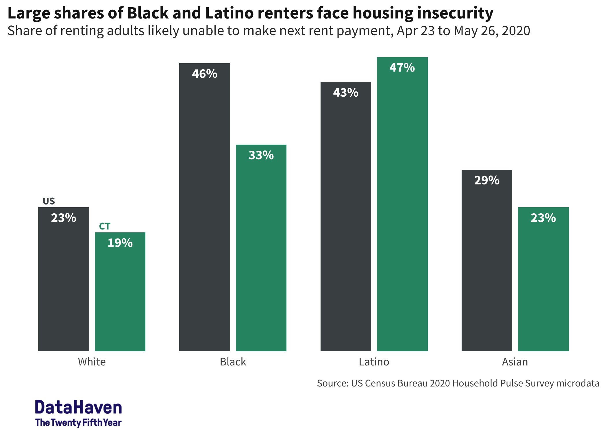
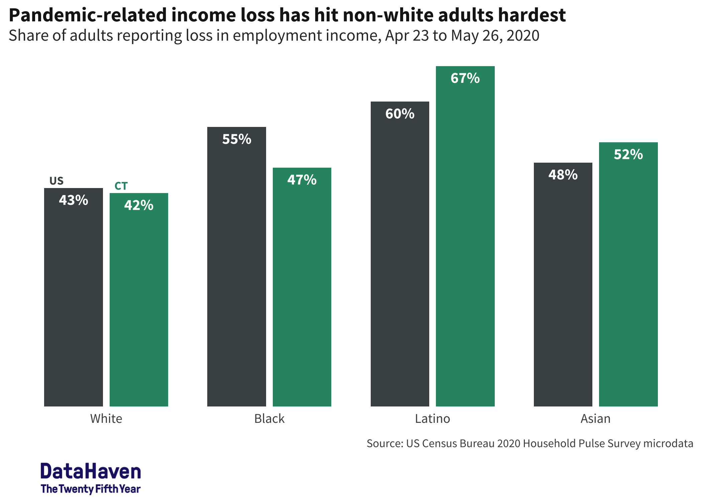
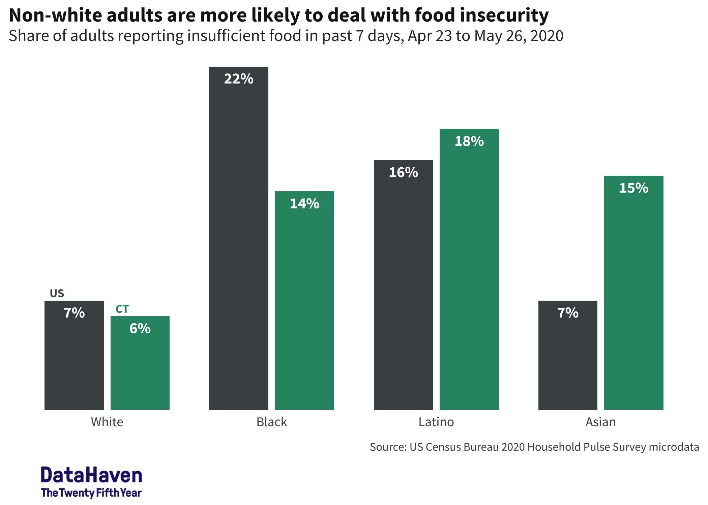

plots redo
================

``` r
library(tidyverse)
library(showtext)
library(srvyr)
library(rvest)

font_add_google(name = "Source Sans Pro")
showtext_auto()

theme_src <- function(base_family = "Source Sans Pro", base_size = 12, ...) {
  camiller::theme_din(base_family = base_family, base_size = base_size, ...) +
    theme(plot.title.position = "plot",
          plot.caption.position = "panel",
          strip.text = element_text(face = "bold"),
          legend.title = element_text(size = rel(1)),
          legend.text = element_text(size = rel(0.75)),
          legend.key.width = unit(1.1, "lines"),
          legend.key.height = unit(0.8, "lines"))
}

theme_set(theme_src())
update_geom_defaults("text", list(family = "Source Sans Pro", fontface = "bold"))

logo <- cowplot::ggdraw() + 
  cowplot::draw_image("plots/25th_logo_alpha.png", x = 0, hjust = 0, width = 0.25) +
  theme(plot.margin = margin(0.05, 0.05, 0.05, 0.05, "in"))
```

# microdata

Changes:

  - it’s easier to keep track of survey variables as factors
  - we abbreviate race as white, black, latino, asian (if large enough
    sample), other, where anything other than latino is defined as
    non-hispanic (hispanic is also a weird label that we generally don’t
    use)
  - mark off the non-answers as NA (-88, -99)
  - using `srvyr` gives access to weighted aggregate functions so you
    don’t have to worry as much about weighting correctly or calculating
    MOEs
  - dropping NYC comparisons

<!-- end list -->

``` r
micro <- list.files("data/microdata", full.names = TRUE) %>%
  map_dfr(readRDS) %>%
  janitor::clean_names() %>%
  mutate(race = ifelse(rhispanic == 2, "latino", as.character(rrace)) %>%
           as_factor() %>%
           fct_recode(white = "1", black = "2", asian = "3", other = "4") %>%
           fct_relevel("white", "black", "latino", "asian") %>%
           fct_relabel(str_to_sentence)) %>%
  select(week, state = est_st, msa = est_msa, pweight, race, food_insecure = curfoodsuf, tenure, housing_insecure = mortconf, income_loss = wrkloss, working = anywork) %>%
  mutate_at(vars(food_insecure:working), ~as_factor(ifelse(. < 0, NA_character_, .))) %>%
  mutate(food_insecure = fct_collapse(food_insecure, not_insecure = c("1", "2"), insecure = c("3", "4")), # how often lacking food
         tenure = fct_recode(tenure, owned_full = "1", owned_mortgage = "2", rented = "3", no_payment = "4"),
         housing_insecure = fct_collapse(housing_insecure, insecure = c("1", "2"), secure = c("3", "4", "5")), # secure includes deferred payments
         income_loss = fct_recode(income_loss, loss = "1", no_loss = "2"),
         working = fct_recode(working, working = "1", not_working = "2"),
         msa = as.character(msa))

# two survey objects, one for national, one for just ct
us_srvy <- as_survey_design(micro, weights = pweight)
ct_srvy <- micro %>% filter(state == "09") %>% as_survey_design(weights = pweight)

# put them in a list to map & combine
srvys <- lst(us_srvy, ct_srvy) %>% set_names(substr, 1, 2)
```

``` r
# writing functions bc I'm lazy
survey_share_by <- function(srvy, ..., digits = 2) {
  grp_vars <- quos(...)
  srvy %>%
    group_by(!!!grp_vars) %>%
    summarise(share = survey_mean()) %>%
    mutate_at(vars(matches("share")), round, digits = digits)
}

compare_share <- function(srvy_lst, ...) {
  srvy_lst %>%
    map_dfr(survey_share_by, ..., .id = "name") %>%
    mutate(name = as_factor(name) %>% fct_relabel(toupper))
}
```

``` r
week <- max(micro$week)

# kinda silly but keeping in spirit of being able to reproduce this every week
date_range <- read_html("https://www.census.gov/programs-surveys/household-pulse-survey/datasets.html") %>%
  html_nodes("h4.uscb-h4") %>%
  html_text() %>%
  str_match_all("([A-Z][a-z]+ \\d{1,2})") %>%
  map(~.[,1]) %>%
  # in case not actually working with all data that's available, pull items 1:week
  rev() %>%
  `[`(1:week) %>%
  flatten_chr() %>%
  paste("2020") %>%
  lubridate::mdy() %>%
  range()
date_fmt <- format(date_range, "%b %e") %>%
  paste(collapse = " to ") %>%
  paste0(", 2020")
# date range formatted as Apr 23 to May 26, 2020

pal <- c(US = "#495051", CT = "#2d9372")
```

## housing

should be labeled as housing insecurity, not rent burden—cost burden is
a specific benchmark in talking about housing (share of total income
going toward housing costs)

plot changes:

  - `geom_col` = `geom_bar(stat = "identity")`
  - `position_dodge2` gives spacing between bars in group—maybe personal
    preference, but butted up together is awkward
  - arrange geographies in decreasing size: US, then CT
  - personal problem, but I hate colorbrewer’s qualitative palettes.
    they also aren’t particularly colorblind-friendly—that’s an
    oversight of mine I’m trying to get better at
  - also re: colors, we’re focused primarily on CT, secondarily how it
    compares to US, so use a palette where CT is a brighter color & US
    is a muted one, instead of giving them equal strength
  - don’t need to label y-axis ticks because the scale is already
    established by directly labeling bars’ values. pick one, but direct
    labeling is way better in this case anyway
  - unless bars are super small, labels should go inside bar; otherwise
    they add height to the bars that isn’t connected to any data
  - unnecessary to label race—it’s obvious to readers
  - shorter, less specific y-axis label is fine
  - give actual dates in subtitle, put source at bottom
  - don’t need title-case on axis
  - move logo below all plot encodings
  - flush y-axis to bottom of plot area (`expand` argument)
  - removing horizontal gridlines after taking off y-axis ticks, but
    vertical gridlines don’t do anything anyway
  - changed race categories (see above)
  - when possible / makes sense, it’s good to replace legends with
    direct labeling—saves space and allows viewer to read chart all at
    once instead of looking back & forth btw chart & legend
  - using dummy number on x-axis to align location labels properly

<!-- end list -->

``` r
housing <- srvys %>%
  map(filter, !is.na(tenure), !is.na(housing_insecure)) %>%
  compare_share(race, tenure, housing_insecure) %>%
  filter(housing_insecure == "insecure", race != "Other") %>%
  filter(tenure == "rented") %>%
  mutate(race_num = as.numeric(race))
```

    ## Warning: The `add` argument of `group_by()` is deprecated as of dplyr 1.0.0.
    ## Please use the `.add` argument instead.
    ## This warning is displayed once every 8 hours.
    ## Call `lifecycle::last_warnings()` to see where this warning was generated.

``` r
# use this to offset labels proportionally
housing_offset <- max(housing$share) / 100

housing_bars <- housing %>% 
  ggplot(aes(x = race_num, y = share, fill = name, group = name)) +
  geom_col(aes(x = race), position = position_dodge2(), width = 0.8) +
  # percentage labels
  geom_text(aes(label = scales::percent(share, accuracy = 1), y = share - 2 * housing_offset), color = "white", vjust = 1, position = position_dodge2(width = 0.8)) +
  # location labels
  geom_text(aes(label = name, color = name, y = share + housing_offset, x = race_num - 0.15),
            data = . %>% top_n(-1, race_num),
            size = 3, position = position_dodge2(width = 0.8), vjust = 0, hjust = 0) +
  scale_fill_manual(values = pal) +
  scale_color_manual(values = pal) +
  scale_y_continuous(expand = expansion(mult = c(0, 0.05)), breaks = NULL) +
  labs(x = NULL, y = NULL,
       title = "Large shares of Black and Latino renters face housing insecurity",
       subtitle = str_glue("Share of renting adults likely unable to make next rent payment, {date_fmt}"),
       caption = "Source: US Census Bureau 2020 Household Pulse Survey microdata") +
  theme(legend.position = "none")

# there are other ways to do this but cowplot is most painless without hardcoding anything
housing_plot <- cowplot::plot_grid(housing_bars, logo,
                                   ncol = 1, rel_heights = c(10, 1))
```

    ## Warning in grid.Call(C_stringMetric, as.graphicsAnnot(x$label)): font family
    ## 'Source Sans Pro' not found in PostScript font database

    ## Warning in grid.Call(C_stringMetric, as.graphicsAnnot(x$label)): font family
    ## 'Source Sans Pro' not found in PostScript font database
    
    ## Warning in grid.Call(C_stringMetric, as.graphicsAnnot(x$label)): font family
    ## 'Source Sans Pro' not found in PostScript font database
    
    ## Warning in grid.Call(C_stringMetric, as.graphicsAnnot(x$label)): font family
    ## 'Source Sans Pro' not found in PostScript font database
    
    ## Warning in grid.Call(C_stringMetric, as.graphicsAnnot(x$label)): font family
    ## 'Source Sans Pro' not found in PostScript font database
    
    ## Warning in grid.Call(C_stringMetric, as.graphicsAnnot(x$label)): font family
    ## 'Source Sans Pro' not found in PostScript font database
    
    ## Warning in grid.Call(C_stringMetric, as.graphicsAnnot(x$label)): font family
    ## 'Source Sans Pro' not found in PostScript font database
    
    ## Warning in grid.Call(C_stringMetric, as.graphicsAnnot(x$label)): font family
    ## 'Source Sans Pro' not found in PostScript font database
    
    ## Warning in grid.Call(C_stringMetric, as.graphicsAnnot(x$label)): font family
    ## 'Source Sans Pro' not found in PostScript font database
    
    ## Warning in grid.Call(C_stringMetric, as.graphicsAnnot(x$label)): font family
    ## 'Source Sans Pro' not found in PostScript font database
    
    ## Warning in grid.Call(C_stringMetric, as.graphicsAnnot(x$label)): font family
    ## 'Source Sans Pro' not found in PostScript font database
    
    ## Warning in grid.Call(C_stringMetric, as.graphicsAnnot(x$label)): font family
    ## 'Source Sans Pro' not found in PostScript font database
    
    ## Warning in grid.Call(C_stringMetric, as.graphicsAnnot(x$label)): font family
    ## 'Source Sans Pro' not found in PostScript font database
    
    ## Warning in grid.Call(C_stringMetric, as.graphicsAnnot(x$label)): font family
    ## 'Source Sans Pro' not found in PostScript font database
    
    ## Warning in grid.Call(C_stringMetric, as.graphicsAnnot(x$label)): font family
    ## 'Source Sans Pro' not found in PostScript font database
    
    ## Warning in grid.Call(C_stringMetric, as.graphicsAnnot(x$label)): font family
    ## 'Source Sans Pro' not found in PostScript font database
    
    ## Warning in grid.Call(C_stringMetric, as.graphicsAnnot(x$label)): font family
    ## 'Source Sans Pro' not found in PostScript font database
    
    ## Warning in grid.Call(C_stringMetric, as.graphicsAnnot(x$label)): font family
    ## 'Source Sans Pro' not found in PostScript font database
    
    ## Warning in grid.Call(C_stringMetric, as.graphicsAnnot(x$label)): font family
    ## 'Source Sans Pro' not found in PostScript font database
    
    ## Warning in grid.Call(C_stringMetric, as.graphicsAnnot(x$label)): font family
    ## 'Source Sans Pro' not found in PostScript font database
    
    ## Warning in grid.Call(C_stringMetric, as.graphicsAnnot(x$label)): font family
    ## 'Source Sans Pro' not found in PostScript font database
    
    ## Warning in grid.Call(C_stringMetric, as.graphicsAnnot(x$label)): font family
    ## 'Source Sans Pro' not found in PostScript font database
    
    ## Warning in grid.Call(C_stringMetric, as.graphicsAnnot(x$label)): font family
    ## 'Source Sans Pro' not found in PostScript font database
    
    ## Warning in grid.Call(C_stringMetric, as.graphicsAnnot(x$label)): font family
    ## 'Source Sans Pro' not found in PostScript font database
    
    ## Warning in grid.Call(C_stringMetric, as.graphicsAnnot(x$label)): font family
    ## 'Source Sans Pro' not found in PostScript font database
    
    ## Warning in grid.Call(C_stringMetric, as.graphicsAnnot(x$label)): font family
    ## 'Source Sans Pro' not found in PostScript font database
    
    ## Warning in grid.Call(C_stringMetric, as.graphicsAnnot(x$label)): font family
    ## 'Source Sans Pro' not found in PostScript font database
    
    ## Warning in grid.Call(C_stringMetric, as.graphicsAnnot(x$label)): font family
    ## 'Source Sans Pro' not found in PostScript font database
    
    ## Warning in grid.Call(C_stringMetric, as.graphicsAnnot(x$label)): font family
    ## 'Source Sans Pro' not found in PostScript font database
    
    ## Warning in grid.Call(C_stringMetric, as.graphicsAnnot(x$label)): font family
    ## 'Source Sans Pro' not found in PostScript font database
    
    ## Warning in grid.Call(C_stringMetric, as.graphicsAnnot(x$label)): font family
    ## 'Source Sans Pro' not found in PostScript font database
    
    ## Warning in grid.Call(C_stringMetric, as.graphicsAnnot(x$label)): font family
    ## 'Source Sans Pro' not found in PostScript font database
    
    ## Warning in grid.Call(C_stringMetric, as.graphicsAnnot(x$label)): font family
    ## 'Source Sans Pro' not found in PostScript font database
    
    ## Warning in grid.Call(C_stringMetric, as.graphicsAnnot(x$label)): font family
    ## 'Source Sans Pro' not found in PostScript font database
    
    ## Warning in grid.Call(C_stringMetric, as.graphicsAnnot(x$label)): font family
    ## 'Source Sans Pro' not found in PostScript font database
    
    ## Warning in grid.Call(C_stringMetric, as.graphicsAnnot(x$label)): font family
    ## 'Source Sans Pro' not found in PostScript font database
    
    ## Warning in grid.Call(C_stringMetric, as.graphicsAnnot(x$label)): font family
    ## 'Source Sans Pro' not found in PostScript font database
    
    ## Warning in grid.Call(C_stringMetric, as.graphicsAnnot(x$label)): font family
    ## 'Source Sans Pro' not found in PostScript font database
    
    ## Warning in grid.Call(C_stringMetric, as.graphicsAnnot(x$label)): font family
    ## 'Source Sans Pro' not found in PostScript font database
    
    ## Warning in grid.Call(C_stringMetric, as.graphicsAnnot(x$label)): font family
    ## 'Source Sans Pro' not found in PostScript font database
    
    ## Warning in grid.Call(C_stringMetric, as.graphicsAnnot(x$label)): font family
    ## 'Source Sans Pro' not found in PostScript font database
    
    ## Warning in grid.Call(C_stringMetric, as.graphicsAnnot(x$label)): font family
    ## 'Source Sans Pro' not found in PostScript font database
    
    ## Warning in grid.Call(C_stringMetric, as.graphicsAnnot(x$label)): font family
    ## 'Source Sans Pro' not found in PostScript font database
    
    ## Warning in grid.Call(C_stringMetric, as.graphicsAnnot(x$label)): font family
    ## 'Source Sans Pro' not found in PostScript font database
    
    ## Warning in grid.Call(C_stringMetric, as.graphicsAnnot(x$label)): font family
    ## 'Source Sans Pro' not found in PostScript font database
    
    ## Warning in grid.Call(C_stringMetric, as.graphicsAnnot(x$label)): font family
    ## 'Source Sans Pro' not found in PostScript font database
    
    ## Warning in grid.Call(C_stringMetric, as.graphicsAnnot(x$label)): font family
    ## 'Source Sans Pro' not found in PostScript font database
    
    ## Warning in grid.Call(C_stringMetric, as.graphicsAnnot(x$label)): font family
    ## 'Source Sans Pro' not found in PostScript font database
    
    ## Warning in grid.Call(C_stringMetric, as.graphicsAnnot(x$label)): font family
    ## 'Source Sans Pro' not found in PostScript font database
    
    ## Warning in grid.Call(C_stringMetric, as.graphicsAnnot(x$label)): font family
    ## 'Source Sans Pro' not found in PostScript font database
    
    ## Warning in grid.Call(C_stringMetric, as.graphicsAnnot(x$label)): font family
    ## 'Source Sans Pro' not found in PostScript font database
    
    ## Warning in grid.Call(C_stringMetric, as.graphicsAnnot(x$label)): font family
    ## 'Source Sans Pro' not found in PostScript font database
    
    ## Warning in grid.Call(C_stringMetric, as.graphicsAnnot(x$label)): font family
    ## 'Source Sans Pro' not found in PostScript font database
    
    ## Warning in grid.Call(C_stringMetric, as.graphicsAnnot(x$label)): font family
    ## 'Source Sans Pro' not found in PostScript font database
    
    ## Warning in grid.Call(C_stringMetric, as.graphicsAnnot(x$label)): font family
    ## 'Source Sans Pro' not found in PostScript font database
    
    ## Warning in grid.Call(C_stringMetric, as.graphicsAnnot(x$label)): font family
    ## 'Source Sans Pro' not found in PostScript font database

``` r
housing_plot
```

<!-- -->

## loss of income

Changes: same as previous, plus

  - title needs to be clearer & have matching tense
  - we don’t capitalize white, only non-white groups
  - percent of adults, not households
  - technically employment income (might still have other sources of
    income like SSI that remain same)

<!-- end list -->

``` r
income <- srvys %>%
  map(filter, !is.na(income_loss)) %>%
  compare_share(race, income_loss) %>%
  filter(income_loss == "loss", race != "Other") %>%
  mutate(race_num = as.numeric(race))

income_offset <- max(income$share) / 100

income_bars <- income %>%
  ggplot(aes(x = race_num, y = share, fill = name, group = name)) +
  geom_col(aes(x = race), position = position_dodge2(), width = 0.8) +
  # percentage labels
  geom_text(aes(label = scales::percent(share, accuracy = 1), y = share - 2 * income_offset), color = "white", vjust = 1, position = position_dodge2(width = 0.8)) +
  # location labels
  geom_text(aes(label = name, color = name, y = share + income_offset, x = race_num - 0.15),
            data = . %>% top_n(-1, race_num),
            size = 3, position = position_dodge2(width = 0.8), vjust = 0, hjust = 0) +
  scale_fill_manual(values = pal) +
  scale_color_manual(values = pal) +
  scale_y_continuous(expand = expansion(mult = c(0, 0.05)), breaks = NULL) +
  labs(x = NULL, y = NULL,
       title = "Pandemic-related income loss has hit non-white adults hardest",
       subtitle = str_glue("Share of adults reporting loss in employment income, {date_fmt}"),
       caption = "Source: US Census Bureau 2020 Household Pulse Survey microdata") +
  theme(legend.position = "none")

income_loss_plot <- cowplot::plot_grid(income_bars, logo,
                                   ncol = 1, rel_heights = c(10, 1))

income_loss_plot
```

<!-- -->

## food insecurity

Changes: same as prev, plus

  - lump often & sometimes together as measure of insecurity
  - adults, not households

<!-- end list -->

``` r
food_insecure <- srvys %>%
  map(filter, !is.na(food_insecure)) %>%
  compare_share(race, food_insecure) %>%
  filter(food_insecure == "insecure", race != "Other") %>%
  mutate(race_num = as.numeric(race))

food_offset <- max(food_insecure$share) / 100

food_bars <- food_insecure %>%
  ggplot(aes(x = race_num, y = share, fill = name, group = name)) +
  geom_col(aes(x = race), position = position_dodge2(), width = 0.8) +
  # percentage labels
  geom_text(aes(label = scales::percent(share, accuracy = 1), y = share - 2 * food_offset), color = "white", vjust = 1, position = position_dodge2(width = 0.8)) +
  # location labels
  geom_text(aes(label = name, color = name, y = share + food_offset, x = race_num - 0.15),
            data = . %>% top_n(-1, race_num),
            size = 3, position = position_dodge2(width = 0.8), vjust = 0, hjust = 0) +
  scale_fill_manual(values = pal) +
  scale_color_manual(values = pal) +
  scale_y_continuous(expand = expansion(mult = c(0, 0.05)), breaks = NULL) +
  labs(x = NULL, y = NULL,
       title = "Non-white adults are more likely to deal with food insecurity",
       subtitle = str_glue("Share of adults reporting insufficient food in past 7 days, {date_fmt}"),
       caption = "Source: US Census Bureau 2020 Household Pulse Survey microdata") +
  theme(legend.position = "none")

food_insecurity_plot <- cowplot::plot_grid(food_bars, logo,
                                   ncol = 1, rel_heights = c(10, 1))

food_insecurity_plot
```

<!-- -->

``` r
lst(housing_plot, income_loss_plot, food_insecurity_plot) %>%
  set_names(str_extract, "^\\w+(?=_plot)") %>%
  iwalk(function(plot, name) {
    file <- str_glue("{name}_by_race.png")
    ggsave(file.path("plots", file), plot, dpi = 300, width = 7, height = 5)
  })
```
